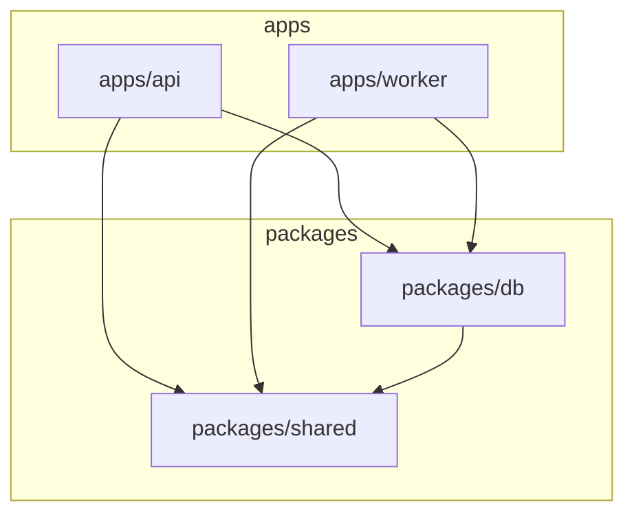

# 3 — Architecture et flux de données

Objectif : comprendre le parcours d’un vote de bout en bout, et pourquoi API et worker sont séparés.

## Principe général

L’API doit répondre **vite** aux votants (milliers de requêtes simultanées possibles). Le calcul des résultats (histogrammes, médianes, classement) est **plus lent** et fait en arrière-plan.

```
  Votant                    API                      Redis                 Worker                  Postgres
    │                        │                         │                      │                        │
    │── POST /votes ────────►│                         │                      │                        │
    │                        │── SETNX (anti-doublon)──►│                      │                        │
    │                        │── XADD stream ──────────►│                      │                        │
    │◄── 202 Accepted ───────│                         │                      │                        │
    │                        │                         │◄── XREADGROUP ───────│                        │
    │                        │                         │                      │── UPDATE histogrammes ►│
    │                        │                         │                      │── publish snapshot ───►│
    │── GET /results ───────►│                         │                      │                        │
    │◄── JSON snapshot ──────│◄─────────────────────────────────────────────────── SELECT ──────────│
```

## Étapes détaillées d’un vote

### 1. Authentification

Le votant possède un **JWT** obtenu via OAuth (Facebook, Google) ou `POST /auth/mock/login` en dev.

Le token contient : `pollId`, `platform`, `subjectId`, `displayName`.

En mode **mono-plateforme** (défaut), la plateforme du token doit correspondre à `poll.platform` (sinon `403 PLATFORM_MISMATCH`). Avec `ALLOW_MULTI_PLATFORM_AUTH=true`, toute plateforme activée sur l'instance est acceptée.

### 2. Validation (API — synchrone)

Fichier principal : `apps/api/src/routes/votes.ts`

- Fenêtre de vote (`startsAt` / `endsAt`, `closedAt`)
- Une note par candidat, dans l’intervalle `[gradeMin, gradeMax]`
- Header `X-Data-Region` aligné sur `poll.dataRegion`
- Rate limit par votant (Redis)
- Membership groupe si `visibility: group`

### 3. Anti double-vote (Redis SETNX)

Clé du type `vote:claim:{pollId}:{platform}:{subjectId}`.

Si la clé existe déjà → `409 ALREADY_VOTED`.

C’est la première ligne de défense ; Postgres a aussi une contrainte `UNIQUE` en secours.

### 4. Publication dans le stream (Redis XADD)

Événement `VoteSubmittedEvent` (défini dans `packages/shared/src/types.ts`) :

```typescript
{
  eventId, pollId, platform, subjectId, displayName?,
  grades: [{ itemId, grade }, ...],
  voterMode, submittedAt, idempotencyKey?
}
```

L’API répond **202** ou **200** sans attendre l’agrégation Postgres.

### 5. Consommation (Worker)

Fichier : `apps/worker/src/worker.ts`

- Vérifie le stream toutes les `WORKER_POLL_INTERVAL_MS` (défaut 60 000 ms)
- Ne traite que s’il y a du travail (optimisation)
- Consumer group Redis : plusieurs workers possibles en prod (un seul en dev)
- ACK après succès ; les échecs restent en pending pour retry

### 6. Agrégation (packages/db)

`processVoteEventBatch` :

- Mode **anonymous** → table `vote_participation` uniquement
- Mode **public** → `vote_participation` + `vote_ballots` (notes visibles par `subjectId`)
- Met à jour les **histogrammes** par candidat et par note

### 7. Publication snapshot

`maybePublishSnapshot` (`packages/db/src/publish-snapshot.ts`) :

- Verrou advisory Postgres par `pollId` (évite les courses)
- Vérifie la **politique de résultats** (`threshold_10`, `end_only`, etc.)
- Respecte `SNAPSHOT_MIN_INTERVAL_MS` entre deux publications
- Calcule médianes, classement MJ, ballotage, ex-aequo

Les pages `results.html` et `creator.html` pollent `GET /polls/:id/results`.

## Séparation API / Worker en production

| Environnement | API | Worker |
|---------------|-----|--------|
| **Dev local** | `npm run dev` | même commande (concurrently) |
| **Render (pilote)** | Service web Render | Machine self-hosted (`npm run worker:prod`) |
| **Fallback** | `scripts/render-start.sh` | API + worker dans le même conteneur |

Deux fichiers d’environnement distincts :

- `.env` → docker-compose local **uniquement**
- `.env.worker.prod` → URLs externes Render **uniquement**

Ne jamais mélanger : le worker prod pointerait vers la mauvaise base.

## Redis : deux usages

| Usage | Rôle |
|-------|------|
| **SETNX / rate limit** | Côté API, latence minimale |
| **Stream `votes`** | File d’événements durable entre API et worker |
| **Compteur live** | `liveVoteCount` affiché avant snapshot |

## Postgres : tables principales

| Table | Contenu |
|-------|---------|
| `polls` | Métadonnées sondage |
| `poll_items` | Candidats (3 à 14) |
| `vote_participation` | Qui a voté (tous modes) |
| `vote_ballots` | Bulletins détaillés (mode public) |
| `vote_histograms` | Compteurs par note et candidat |
| `result_snapshots` | Versions JSON des résultats publiés |

Le schéma Drizzle (`packages/db/src/schema.ts`) reflète ces tables ; les **migrations SQL** dans `migrations/` sont la source de vérité.

## Régions données

Chaque sondage a `data_region` (`EU`, `US`, `GLOBAL`).

Les clients envoient `X-Data-Region`. Un mismatch renvoie **451 REGION_MISMATCH**.

En production multi-région : une stack complète (API + worker + Postgres + Redis) par région.

## Embed et API

L’API sert les fichiers statiques :

- `/embed/*` → dossier `embed/`
- `/legal/*` → pages légales depuis `embed/legal/`

Les scripts embed appellent l’API en `fetch` (même origine en dev : `localhost:3000`).

## Diagramme des dépendances npm



## Étape suivante

Les règles métier (MJ, seuils, plateformes) sont détaillées dans [04-domain.md](04-domain.md).
